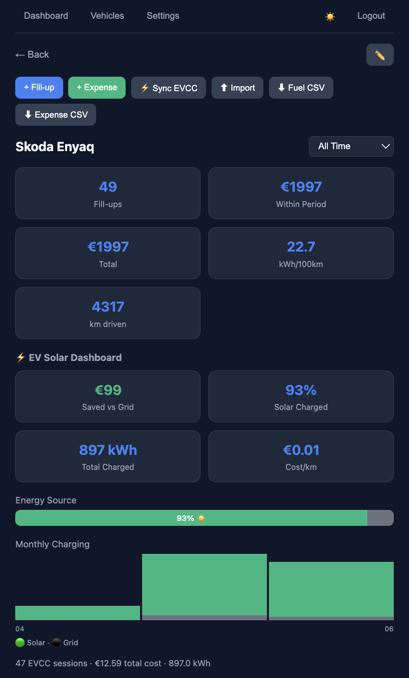
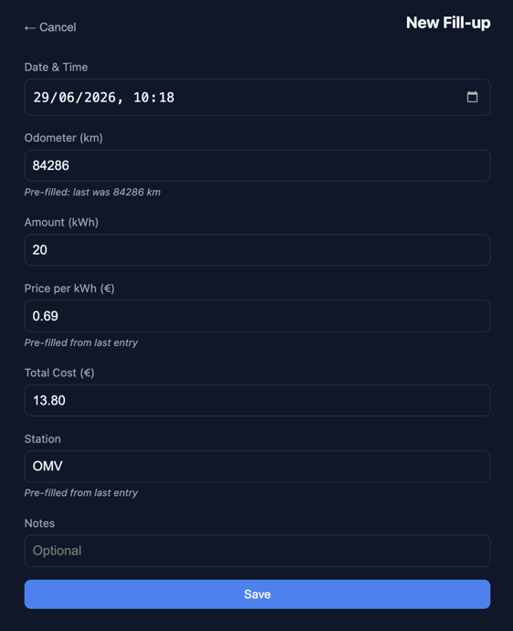
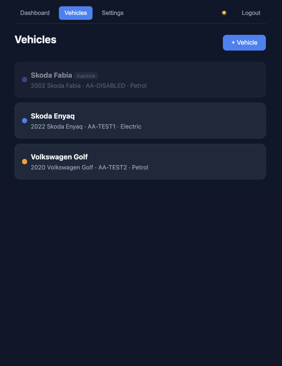

# 🚗 Roadlog

[](https://hub.docker.com/r/stomko11/roadlog)
[](https://ghcr.io/stomko11/roadlog)
[](https://github.com/stomko11/roadlog/releases)

A self-hosted vehicle expense tracking system. Track fuel fill-ups, other expenses, and monitor consumption across all your vehicles.

## Screenshots

<p align="center">
  
  
  
</p>

## Features

- **Multi-vehicle support** — petrol, diesel, LPG, CNG, electric, hybrid, plugin hybrid
- **Plugin Hybrid** — choose fuel or electric per fill-up
- **EVCC integration** — auto-import home charging sessions with solar %, actual cost from dynamic tariffs, and savings vs grid
- **Vehicle lifecycle** — mark vehicles as inactive (won't appear in new entries) or hide from stats
- **Smart fill-up form** — pre-fills last odometer, price, station (configurable)
- **Saved stations** — per fuel type, with autocomplete suggestions
- **Other expenses** — insurance, service, repair, tires, parking, tolls, etc.
- **Dashboard** — monthly spending charts (per vehicle, color-coded), period filters, total distance driven
- **Per-vehicle charts** — consumption trends, price trends
- **Multi-user** — shared vehicles, user management
- **CSV import** — with smart column mapping and auto-guess
- **CSV export & full backup/restore**
- **Dark/light theme**
- **Configurable units** — currency (EUR, USD, GBP, CZK, PLN…), volume (L, gal), distance (km, mi)
- **Single container** — Go backend + embedded frontend, SQLite database

## EVCC Integration

Automatically import EV charging sessions from [EVCC](https://evcc.io) with full solar/cost data.

**Setup:**
1. Go to your EV's edit page → EVCC Integration section
2. Enter your EVCC instance URL (e.g. `http://192.168.x.x:7070`)
3. Click "Connect & Discover" — select vehicle and loadpoint
4. Set a label (e.g. "Home"), sync-since date, and optionally enable daily auto-sync
5. Set a fallback price for sessions without tariff data (estimates cost using solar %)

**What gets imported:**
- Charged energy (kWh)
- Actual cost (from dynamic tariffs, accounting for solar share)
- Solar percentage per session
- Odometer reading
- Savings vs full grid price

**Deduplication:** Sessions are tagged with their EVCC session ID — re-syncing never creates duplicates.

**Multiple sources:** You can add multiple EVCC instances per vehicle (e.g. home + parents' house).

## Automatic Backup

Roadlog can automatically back up your data to **WebDAV (Nextcloud)** or a **local path** on a daily or weekly schedule.

Configure in **Settings → Automatic Backup**.

### WebDAV (Nextcloud) Setup

1. In Nextcloud, create a folder for backups (e.g. `Backups/Roadlog`)
2. Go to **Settings → Security → Devices & sessions**
3. Enter a name (e.g. "Roadlog") and click **Create new app password**
4. Copy the generated token

In Roadlog settings:
- **Type:** WebDAV (Nextcloud)
- **URL:** `https://your-cloud.com/remote.php/dav/files/YOUR_USERNAME/Backups/Roadlog/`
- **Username:** your Nextcloud username (found in Settings → Personal info)
- **Password:** the app password token from step 3

> 💡 Use an app password instead of your main password — it bypasses 2FA and can be revoked independently.

### Local Path

Set a directory path (e.g. `/backups/roadlog`). Mount a volume to that path in Docker:

```yaml
volumes:
  - ./data:/data
  - /mnt/nas/backups/roadlog:/backups/roadlog
```

Roadlog will write timestamped JSON backups and auto-clean old ones based on your retention setting.

### Options

| Setting | Description | Default |
|---------|-------------|---------|
| Schedule | Daily or weekly | Daily |
| Retain | Number of backups to keep | 7 |

You can also click **Run Now** to trigger a backup manually.

## Quick Start

### Unraid

1. In Unraid, go to **Docker → Template Repositories**
2. Add: `https://github.com/stomko11/roadlog`
3. Click **Add Container**, select the **Roadlog** template
4. Click **Apply** — done!

Data is stored in `/mnt/user/appdata/roadlog` by default.

### Docker Compose

```yaml
services:
  roadlog:
    image: stomko11/roadlog:latest
    container_name: roadlog
    ports:
      - "3000:3000"
    volumes:
      - ./data:/data
    restart: unless-stopped
```

```bash
docker compose up -d
```

Open http://localhost:3000

**Default credentials:** `admin@roadlog.local` / `roadlog`

> ⚠️ Change the default password after first login.

### Alternative registries

- Docker Hub: `stomko11/roadlog:latest`
- GitHub Container Registry: `ghcr.io/stomko11/roadlog:latest`

## Environment Variables

| Name | Description | Default |
|------|-------------|---------|
| `JWT_SECRET` | Secret for signing auth tokens | `roadlog-change-me-in-production` |
| `PORT` | Server port | `3000` |
| `DATA_DIR` | Directory for SQLite database | `/data` |

## Build from Source

Requirements: Go 1.22+

```bash
cd backend
go mod tidy
go build -o roadlog .
DATA_DIR=. ./roadlog
```

Open http://localhost:3000

## Tech Stack

- **Backend:** Go, Gin, GORM, SQLite
- **Frontend:** Vanilla JS (embedded single HTML file)
- **Container:** Alpine Linux (~20MB)

## Development

```bash
cd backend
DATA_DIR=. go run main.go
```

The frontend is embedded in `backend/static/index.html`. Changes require rebuilding the Go binary.

## License

MIT
